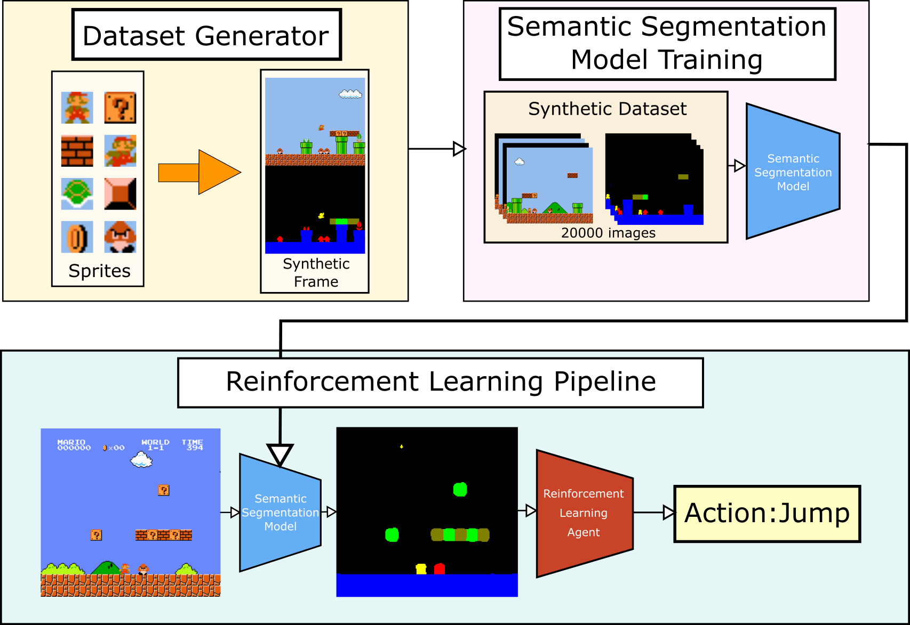

# Exploiting Semantic Segmentation To Boost Reinforcement Learning In Video Game Environments

    <em>Left: Original Frame, Right: Segmented frame used as input for the RL model.</em>

## Framework

The system is composed of three modules, each can be found inside a folder in this repository, along with a small readme on how to use them.

The dataset_generator contains all the code we used to create the synthetic frames that resemble videogame frames. 

The semantic_segmentation folder contains the code required to train the DeepLabV3 model with different backbones. These are available as Jupyter notebooks and python files.

The reinforcement_learning folder contains the different scripts required to run the reinforcement learning algorithm on the super mario bros game with semantic segmentation. Will be available soon (changing files to be more easily usable!).

## Results overview

- Using semantically segmented frames as inputs makes the same model learn faster and to a higher performance level than just using RGB frames.

- Allows for other training strategies, like training on multiple levels at the same time, or performing transfer learning with pre-trained models between different looking levels.

More results and details about the different tests can be found in the complete [paper](https://link.springer.com/article/10.1007/s11042-022-13695-1). 

## Acknowledgements
This work is part of the preliminary tasks related to the Harvesting Visual Data (HVD) project (PID2021-125051OB-I00) funded by the Ministerio de Ciencia e Innovación of the Spanish Government.